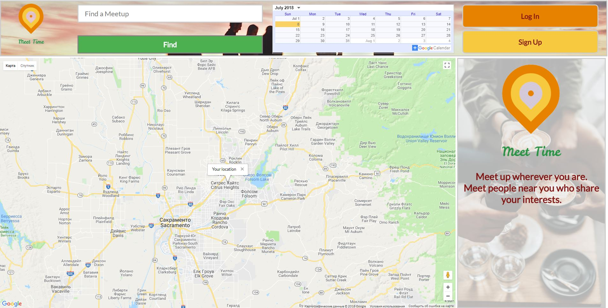
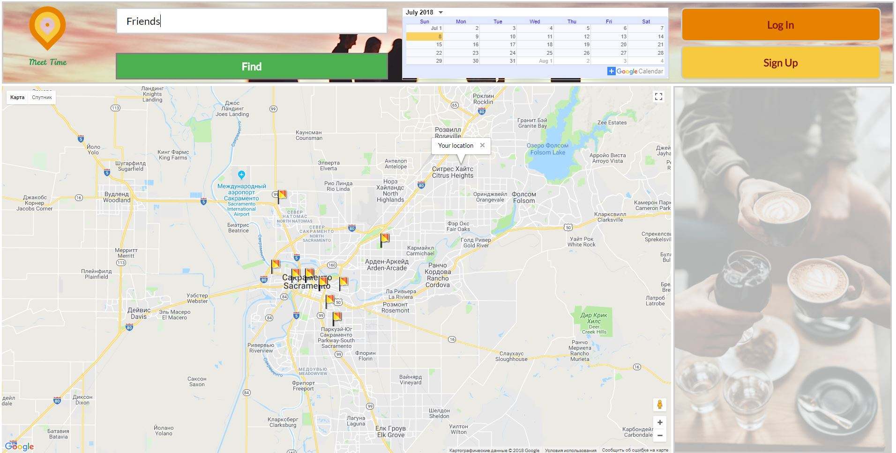
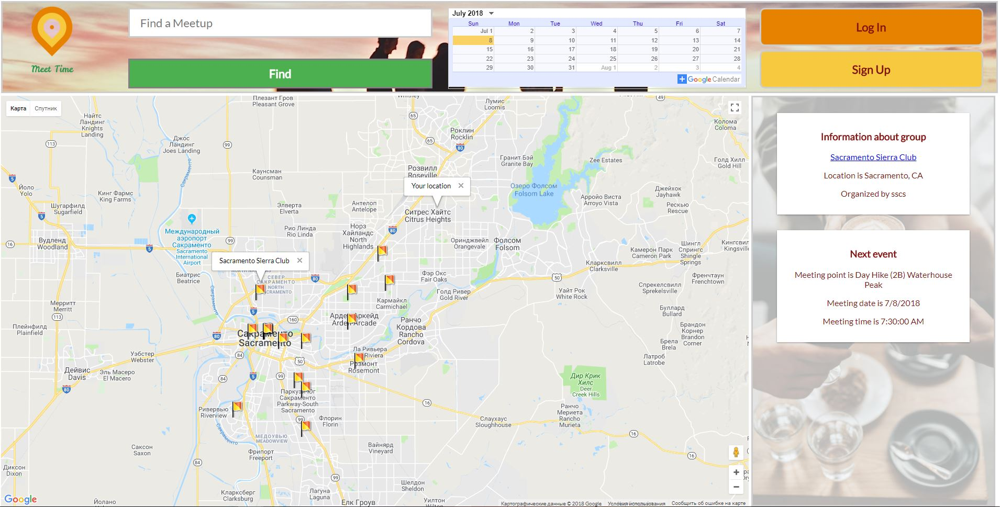

# Project Title

MeetUpSearch (https://ukhlivanov.github.io/MeetUpSearch/)

# Motivation

My application will help users to find interesting meetups in their neighborhood and will show the location and time of the next event for each group.

## Screenshots

Initial screen:

Search by key word:

Result screen:

## Built With

* [HTML]
* [CSS]
* [JavaScript]
* [jQuery]

## Contributing

Google Maps API documentation (https://developers.google.com/maps/documentation/javascript/tutorial)
MeetUp API documentation https://www.meetup.com/meetup_api/

## Authors

* **Sergey Ukhlivanov** - [ukhlivanov](https://github.com/ukhlivanov/)

## Acknowledgments

* Google Maps API
* MeetUp API
* Inspiration
